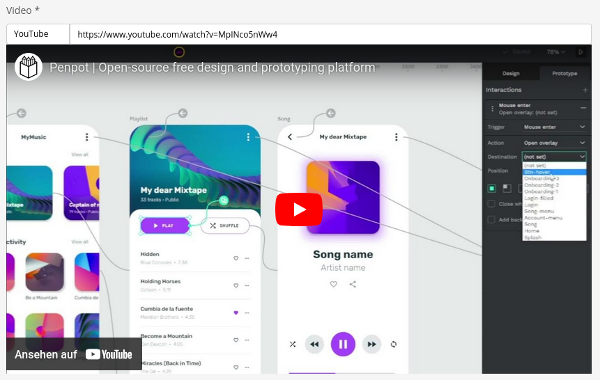

# SuluVideoBundle

> Sulu CMS bundle to preview and extract embed URLs from Youtube, Vimeo, Dailymotion and HTML5 videos.

This bundle adds a new content type `video` and provides the Twig functions `video_provider` and `video_embed_url` to embed external videos in an `iframe` or `video` element.



## Installation

This bundle requires PHP 8.2 or later and [Node 18](https://nodejs.org/en/) (or Node 14 for Sulu versions <2.6.0) for building the Sulu administration UI.

1. Open a command console, enter your project directory and run:

```console
composer require robole/sulu-video-bundle
```

If you're **not** using Symfony Flex, you'll also need to add the bundle in your `config/bundles.php` file:

```php
return [
    //...
    Robole\SuluVideoBundle\SuluVideoBundle::class => ['all' => true],
];
```

2. Link the frontend code by adding the following to your `assets/admin/package.json`:

```json
"dependencies": {
    "sulu-video-bundle": "file:../../vendor/robole/sulu-video-bundle/src/Resources/js"
}
```

3. Import the frontend code by adding the following to your `assets/admin/app.js`:

```javascript
import "sulu-video-bundle";
```

4. Install all npm dependencies and build the admin UI ([see all options](https://docs.sulu.io/en/2.5/cookbook/build-admin-frontend.html)):

```bash
cd assets/admin
npm install
npm run build
```

## Usage

1. Add the `video` content type to any of your page templates:

```xml
<property name="my_video" type="video" mandatory="true">
    <meta>
        <title lang="de">Video</title>
        <title lang="en">Video</title>
    </meta>
</property>
```

2. Render the embeddable link in your twig templates:

```twig

    
        <!-- YouTube, Vimeo or Dailymotion -->
        <iframe
            src="{{ video_embed_url(content['my_video']) }}"
            frameborder="0"
            allow="fullscreen"
        ></iframe>
    
        <!-- HTML5 video -->
        <video
            controls
            src="{{ video_embed_url(content['my_video']) }}"
        ></video>
    

```

### Background

This small bundle serves as a reference for our blog series ["Sulu Bundle Development"](https://robole.de/blog/sulu-bundle-development-part-1) showcasing major steps to build a Sulu bundle from scratch. The underlying idea was inspired by the [Statamic Video Fieldtype](https://statamic.dev/fieldtypes/video).

### Scripts

- To test the PHP code, run:

  > composer phpunit

- To check the coding standards, run:

  > composer php-cs

- To apply coding standards, run:
  > composer php-cs-fix
